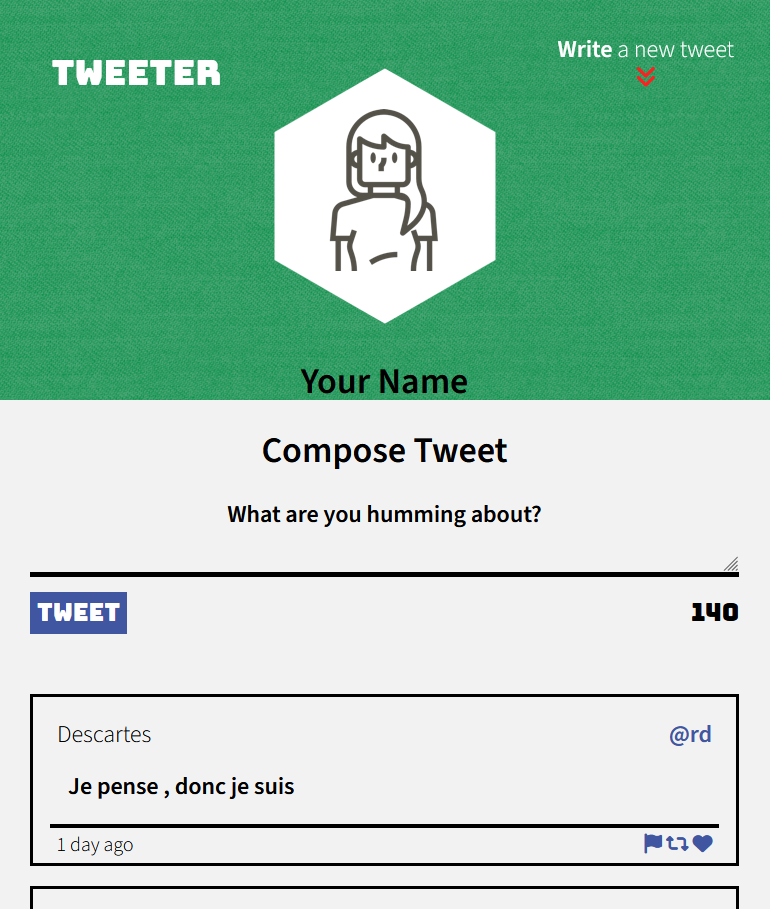
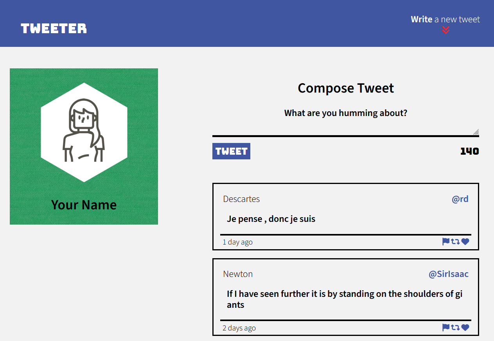

# Tweeter Project

Tweeter is a simple, single-page Twitter (X?) clone. 

There are no persistent user profiles, and no database stores the data, so new tweets are lost on server shutdown. Random profile names and handles are generated when a tweet is posted.

The page has both a vertical layout intended for mobile devices and a landscape layout meant for desktops and tablets. The appropriate layout will be used automatically. 

## Getting Started

1. [Create](https://docs.github.com/en/repositories/creating-and-managing-repositories/creating-a-repository-from-a-template) a new repository using this repository as a template.
2. Clone your repository onto your local device.
3. Install dependencies using the `npm install` command.
3. Start the web server using the `npm run local` command. The app will be served at <http://localhost:8080/>.
4. Go to <http://localhost:8080/> in your browser.

## Dependencies

- Express
- Node 5.10.x or above
